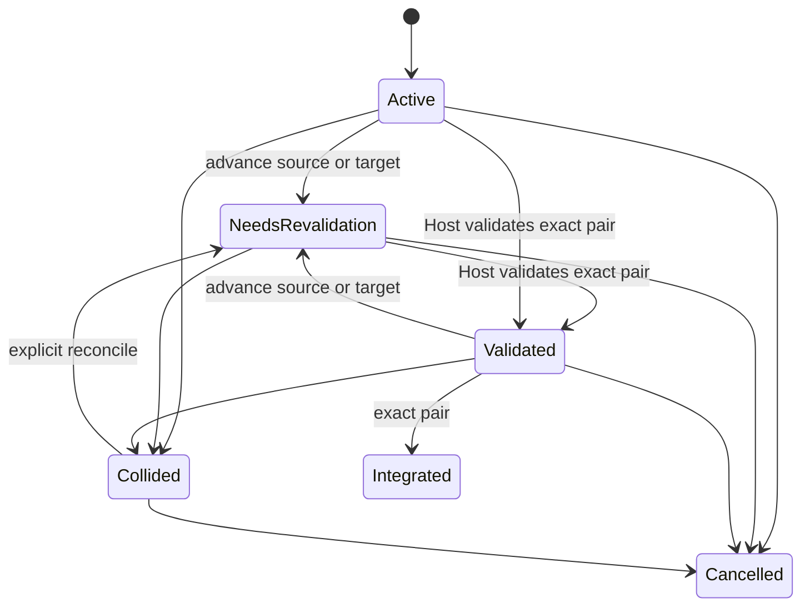

# Domain contracts v1

Canonical owner: [#36](https://github.com/RepairYourTech/SymbioteIDE/issues/36), constrained by [#170](https://github.com/RepairYourTech/SymbioteIDE/issues/170) and the [product constitution](../architecture/product-constitution.md). This is a bounded executable foundation; both issues remain open. It is not a Host, persistence layer, authenticated API, runtime integration, Git implementation or completed ontology.

`symbiote-domain` supplies Rust/Serde records, JSON Schema generation and deterministic pure transitions. Run `cargo test -p symbiote-domain` and `cargo run -p symbiote-domain --example domain_schema` from the repository root. The latter prints the machine-readable schema for `DomainEnvelope`, including distinct entity definitions; redirect it to a build artifact when packaging. No network or installed external agent is needed for these contract tests. The native/external tests prove shared state semantics, not either execution integration.

## Identity, authority and compiled staffing

All internal identities are distinct Rust newtypes serialized as opaque strings. IDs accept 1–128 ASCII letters, digits, `_` or `-`; generation/uniqueness belongs to the future authority. Never derive them from external labels. External references are separately typed system/locator observations. A Role has no runtime identity: re-staffing changes its versioned Binding and creates a new Dispatch. The immutable dispatch snapshot includes the precise Role/operating contract, Binding/Workforce Protocol, Runtime Profile/model/authentication/billing references, eligible selected Host revision, Task contract/revision, context budget, tool/skill requirements, access and verified enforcement claims. Equivalent pinned compilation inputs produce equal snapshots.

Compilation rejects cross-Project or Role lineage, mismatched profile revisions, ineligible Hosts, missing mutation/root access, empty context budgets and missing, expired, future-dated or non-enforcing control claims. Filesystem, cancellation and completion authority controls are mandatory. Network, credential and process grants require corresponding enforcing claims. Observed, emulated and unsupported controls never satisfy mandatory controls. Authentication evidence resolution, entitlement checking and adapter-specific strongest-mechanism qualification are pending integrations; a reference to such evidence does not verify it.

Dispatch snapshots pin the Root, Change Stream and Task Contract as well as Task identity/revision. Starting a dispatch rechecks these values and enforcement expiration at command time, and rejects start times before compilation. Deserializing a dispatch revalidates its invariant-bearing contract. Task and Change Stream deserialization replay the recorded commands and reject state, revisions or validation stamps inconsistent with that replay. This prevents structural transition bypass through edited snapshots; it does not authenticate an invented but internally consistent history.

`AgentRuntimeAdapterId` and `InferenceProviderAdapterId` differ structurally. `RuntimeProfile`, `ProviderConnection`, `CredentialReference` and `BillingEntitlement` are separate records. Credential references contain vault locators only, never secret values. Models and provider connections do not acquire canonical Task authority. `NATIVE_SYMBIOTE` and `EXTERNAL_HARNESS` share the same task transition and completion implementation.

**Trust boundary:** callers must resolve authenticated authoritative records before invoking compilation or transitions. Deserialized records, Host IDs, permission snapshots, enforcement claims, verification runs and evidence are not authentication. The future Host must authenticate actors, fetch current records transactionally, verify artifact/run provenance and reject worker-supplied canonical state. This library does not make a forged serialized Host actor trustworthy. The completion routine validates exact evidence lineage, state and coverage; it does not run the checks, authenticate external CI or inspect artifact contents.

## Task and Change Stream behavior

Tasks belong to exactly one Project, Root, Role and Change Stream in this slice. `Task::apply` accepts versioned commands and retains successful event history. A worker's report moves Running → CompletionRequested only. The selected Host starts verification; only that Host can request canonical completion. Completion requires a validated stream at the exact current source **and target** object IDs and one passing evidence record per required gate: tests, security, impact, documentation, independent review, delivery and Capability Closure. Missing, duplicate, failed, inconclusive, foreign-dispatch, cross-Project, stale or future-dated evidence is rejected. Independent review names a different Role. No applicability exemption API exists yet; none of these gates can be weakened by a prompt, model or learned method.

```mermaid
stateDiagram-v2
    [*] --> Ready
    Ready --> Running: Host starts compiled Dispatch
    Running --> CompletionRequested: worker reports
    CompletionRequested --> Verifying: Host begins verification
    Verifying --> Completed: exact-source/target evidence covers every gate
    Running --> Interrupted
    CompletionRequested --> Interrupted
    Verifying --> Interrupted
    Running --> Failed
    CompletionRequested --> Failed
    Verifying --> Failed
    Running --> Cancelled
    CompletionRequested --> Cancelled
    Verifying --> Cancelled
    Interrupted --> Ready: Host recovers; new Dispatch required
    Failed --> Ready: Host recovers; new Dispatch required
```

Cancellation is terminal; retry after a failure or interruption requires a new dispatch compiled against the new task revision. Recovery preserves the prior event/dispatch history. A new command with a stale expected revision conflicts; an identical command ID/payload returns the original resulting revision even after later transitions. Reusing its ID with changed payload conflicts. Failed operations do not mutate or enter the success history; the Host must durably audit rejected commands separately. Timestamps must be monotonically nondecreasing. This in-memory event vector is a contract fixture, not a bounded durable journal design.

A Change Stream is separate from Tasks, Chats, Sessions, Worktrees and branches. It records membership, originating chat, optional objective, sessions, branch/worktree, source/base/target and either independent lineage or a pinned stacked parent/head. Stream commands preserve revision/history and enforce Project/Root mutation access. Advance invalidates prior validation. Collision requires explicit reconciliation and new validation. Integration requires exact validated source and target. Cancellation and integration are terminal. A validation command records the Host's already-verified run identity; invoking it is not execution proof.

These records do not allocate worktrees, check branch validity, detect semantic collisions, enforce dependency coherence or guarantee two streams cannot claim the same worktree. The future authoritative collection/storage transaction must enforce those cross-record invariants. A stacked parent identity is queryable, but transitive cycle detection and parent movement propagation are pending. Contract tests explicitly model separate worktree/chat identities without claiming physical isolation.

## Ontology coverage and pending acceptance

The table accounts for the required nouns without disguising unimplemented entities as arbitrary JSON. An ID-only entry is **not** a delivered entity schema. Canonical completion of #36 requires the missing entries and full cardinality/ownership/lifecycle coverage.

| Nouns | Delivered representation | Remaining work |
| --- | --- | --- |
| Project, roots/repos, Role | `Project`, `Root`, `Role` | Project/Role mutation, archival/deletion enforcement, root ownership and uniqueness across records |
| Binding, runtime contract, Dispatch | `WorkforceBinding`, `WorkforceRuntimeContract`, `Dispatch` | Full qualification inputs, required artifact contracts, MCP requirements and production compiler integrations |
| Runtime Profile/account/config identity, provider, credentials, entitlement | Distinct profile/provider/credential/billing records and adapter IDs | Verified account/entitlement resolution, native projection ownership and secret leases |
| Task, Change Stream | Executable pure records/transitions, independent/stacked provenance, validation/collision history | Dependencies/coherence, atomic cross-stream collision/integration decisions and physical worktree allocation |
| Session, Chat, Worktree, branch | `Session`; separate Chat/Worktree IDs and stream links; branch is external metadata | Chat/Worktree entity records and foreign/native lifecycle APIs |
| Artifacts, verification runs, evidence | `Artifact`, `VerificationEvidence` with run ID and exact lineage | Run execution/record schema, authenticated provenance and content-address verification |
| Developer Knowledge/documentation | `KnowledgeClaim` with epistemic status, freshness, evidence/ancestry, audience, anchors and projections | Confidence value, publication record, closure/remediation behavior and rejection of circular ancestry |
| User, Host, Fabric, clients/controllers, device, pairing, transport | `Host` plus distinct IDs for User/Fabric/Client/ControllerSession/Device/Pairing | Entity schemas, capability advertisement, execution/service placement, controller authentication and pairing/transport semantics |
| Environments, Harness Drivers/installations, models | Distinct Environment/HarnessDriver/Installation/Model IDs; profile links | Entity schemas, compatibility/version models and lifecycle |
| Requests, objectives, capabilities, dependencies | Request/Objective/Capability IDs; objective linkage | Records, dependency type and lifecycle/completion semantics |
| Requirements, decisions, ambiguities, diagnostics, annotations, plugins, releases | Distinct IDs including ReleaseTarget | Entity schemas, ownership, cardinalities and lifecycle |
| GoalRun, NativeExecution/delegation, ExecutionEpisode | Separate records and explicit parent/goal/dispatch/model/access/budget references | Aggregate budget/cancellation enforcement, child authority validation and episode recovery |
| Learned method, experiment | Separate opt-in method and evidence/sample records | Controlled promotion/rollback, measurements/cost denominators and experiment validity enforcement |
| Workforce Protocol, Role Operating Contract, Task Contract, Context Bundle | Separate revision-bearing references; context policy/budget | Full contract content schemas and canonical compilation owners' integrations |
| Native config projection, ephemeral secret lease | Distinct Projection/SecretLease IDs | Ownership, expiry, reconciliation and lease entity schemas |
| External GitHub/harness/CI/deployment/source/publication/remote Host identifiers | `ExternalReference` with explicit system | Per-system locator validation; mutable external references never replace internal identity |

The #36 acceptance for “every constitution noun maps to exactly one canonical entity/value object” is therefore **pending**. So are complete schema migration tooling, all client-language contract consumers, multi-Host/Fabric behavior, real native/external/hybrid execution, cross-record audit transactions, documentation authority/closure enforcement, physical stream isolation and runtime/Host integration. #170 conformance is demonstrated here only for stable Role identity, deterministic bounded snapshot compilation, explicit enforcement strength and rejection of worker bypass of canonical completion. No broad issue closure is justified by these fixtures.

## Evolution, verification and applicability

`DomainEnvelope.schema_version` is `1`; call `validate_version` before use. Records deny unknown fields. Breaking field, meaning or transition changes require a new schema version and an explicit tested converter; do not deserialize future versions into old authority models or silently drop fields. Version 1 has no prior persisted format to migrate and no persistent implementation may depend on this partial ontology without completing its required contracts. Rollback is removal/reversion of the crate and its consumers; there is no database migration or production state change in this slice.

The contract suite covers native/external canonical parity, deterministic compilation and stable Role identity, unsupported/expired controls, denied permissions, profile/Project/Host mismatches, worker and foreign-Host denial, missing/stale/failed/duplicate evidence, independent review, optimistic races and retry conflicts, interruption/failure recovery and cancellation, revalidation/collision/integration, stream lineage, serialization and schema roots. It does not count fixture claims as actual verification runs. Real consumer conformance, durable crash/replay recovery, no-Codex native execution, billing isolation and multi-Host authority tests remain pending.

Security/privacy applicability is required at the authenticated Host boundary; schema-level denied paths are covered here, secrets remain references. UI accessibility is not applicable to this headless pure-contract slice; workbench acceptance remains required. Cross-platform wire formats are portable but only the current Linux Rust toolchain was exercised. Resource/performance evidence, bounded persistent histories and production concurrency are pending; no efficiency claim is made. This code introduces no telemetry, process launch, network request or credential access.
