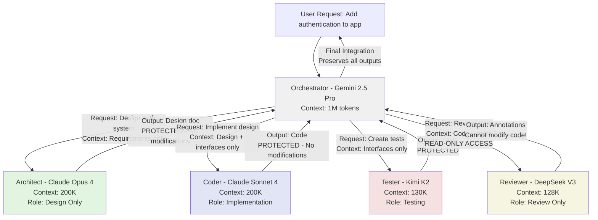

# Agent Communication Protocol - Visual Examples
## AI Master Tool - How Agents Communicate

**Version:** 1.0  
**Date:** January 2025  

---

## Visual Flow Example: Building a Feature



## Communication Rules in Action

### ✅ GOOD: Proper Context Routing

```typescript
// Orchestrator requests specific context for Coder
orchestrator.requestForAgent("coder", {
  context: {
    required: ["interface_definitions", "design_document"],
    exclude: ["implementation_details", "test_code", "historical_discussions"],
    maxTokens: 150000 // Within Claude's 200K limit
  }
});

// Coder receives ONLY what was requested
coder.receives({
  interfaces: "UserAuth { login(), logout(), register() }",
  design: "Authentication flow using JWT...",
  // NOT included: Previous implementations, chat history, unrelated code
});
```

### ❌ BAD: Context Overflow

```typescript
// Orchestrator dumps everything on Coder
orchestrator.requestForAgent("coder", {
  context: {
    everything: true, // 🚫 BAD!
    includeHistory: true, // 🚫 Unnecessary!
    allDiscussions: true // 🚫 Context bloat!
  }
});

// Coder receives 800K tokens >> 200K limit!
// Result: Truncation, lost information, poor output
```

## Output Protection Examples

### Example 1: Code Generation Protected

```typescript
// Claude Sonnet 4 generates perfect authentication code
const authCode = await coder.generate({
  task: "Implement JWT authentication",
  output: {
    content: `
      class AuthService {
        async login(credentials: Credentials): Promise<Token> {
          // Sophisticated implementation
        }
      }
    `,
    protection: "ENFORCED",
    metadata: {
      generator: "claude-sonnet-4",
      quality: "production-ready",
      modifiable: false
    }
  }
});

// Reviewer tries to "improve" the code
reviewer.attempt({
  action: "modify",
  target: authCode,
  changes: "Simplify the implementation" // 🚫 BLOCKED!
});

// System response
{
  error: "PERMISSION_DENIED",
  message: "Reviewer cannot modify Coder's output",
  allowed_actions: ["annotate", "comment", "suggest"]
}
```

### Example 2: Proper Annotation

```typescript
// Reviewer provides feedback WITHOUT modifying
const review = reviewer.annotate({
  target: authCode,
  annotations: [
    {
      line: 15,
      type: "suggestion",
      message: "Consider adding rate limiting here",
      severity: "minor"
    },
    {
      line: 23,
      type: "security",
      message: "Ensure constant-time comparison",
      severity: "important"
    }
  ],
  // Annotations are separate, original code untouched
});

// Orchestrator can present both to user
return {
  code: authCode, // Original, unmodified
  review: review.annotations // Separate feedback
};
```

## Context Request Patterns

### Pattern 1: Minimal Context for Testing

```typescript
// Tester only needs interfaces, not implementation
tester.requestContext({
  what: ["public_interfaces", "expected_behavior"],
  exclude: ["private_methods", "algorithms", "implementation_details"],
  why: "Testing black-box behavior only"
});

// Receives
{
  interfaces: {
    AuthService: ["login()", "logout()", "register()"],
    TokenManager: ["validate()", "refresh()"]
  },
  behavior: {
    login: "Returns token on success, throws on failure",
    logout: "Invalidates all tokens"
  }
  // NOT included: How it works internally
}
```

### Pattern 2: Focused Context for Documentation

```typescript
// Documenter needs public API and examples
documenter.requestContext({
  what: ["public_api", "usage_examples", "architecture_overview"],
  exclude: ["private_code", "tests", "internal_discussions"],
  depth: "summary"
});

// Receives
{
  api: {
    endpoints: ["/auth/login", "/auth/logout"],
    methods: ["AuthService.login()", "AuthService.logout()"]
  },
  examples: ["const token = await auth.login({...})"],
  architecture: "JWT-based stateless authentication"
  // NOT included: Implementation details, test code
}
```

## Configuration Visualization

### Good Configuration Display

```
┌─────────────────────────────────────────────────────┐
│ Agent Configuration: Feature Development Team        │
├─────────────────────────────────────────────────────┤
│                                                     │
│ 🎯 Orchestrator: Gemini 2.5 Pro                    │
│    Context: [████████████░░░░░░░] 600K/1M          │
│    ✓ Sufficient capacity for all agents            │
│                                                     │
│ 🏗️  Architect: Claude Opus 4                       │
│    Context: [███████░░░░░] 140K/200K               │
│    Output: PROTECTED ✓                             │
│                                                     │
│ 💻 Coder: Claude Sonnet 4                          │
│    Context: [████████░░░] 160K/200K                │
│    Output: PROTECTED ✓                             │
│    ⚠️ Warning: Approaching context limit            │
│                                                     │
│ 🧪 Tester: Kimi K2                                 │
│    Context: [████░░░░░░░] 52K/130K                 │
│    Output: PROTECTED ✓                             │
│                                                     │
│ 📝 Reviewer: DeepSeek V3                           │
│    Context: [█████░░░░░░] 64K/128K                 │
│    Permissions: READ-ONLY ✓                        │
│                                                     │
├─────────────────────────────────────────────────────┤
│ Status: ✅ Configuration Valid                      │
│ Warnings: 1 (Coder approaching limit)               │
│ Cost: $8.50/hour                                   │
└─────────────────────────────────────────────────────┘
```

### Bad Configuration Display

```
┌─────────────────────────────────────────────────────┐
│ Agent Configuration: Problematic Setup              │
├─────────────────────────────────────────────────────┤
│                                                     │
│ 🎯 Orchestrator: GPT-4                             │
│    Context: [████████████] 8K/8K                   │
│    ❌ ERROR: Too small for worker outputs!          │
│                                                     │
│ 🏗️  Architect: Gemini 2.5 Pro                      │
│    Context: [█░░░░░░░░░░] 100K/1M                  │
│    ⚠️ Massive context wasted                        │
│    ❌ No output protection                          │
│                                                     │
│ 💻 Coder: Claude Sonnet 4                          │
│    Context: [████████████] 200K/200K FULL!         │
│    ❌ No output protection - quality at risk!       │
│                                                     │
│ 📝 Reviewer: Budget Model                          │
│    Permissions: MODIFY ❌                           │
│    ❌ Should not modify superior model outputs!      │
│                                                     │
├─────────────────────────────────────────────────────┤
│ Status: ❌ INVALID Configuration                    │
│ Errors: 4 CRITICAL                                 │
│ Recommendation: Use Gemini 2.5 as orchestrator     │
└─────────────────────────────────────────────────────┘
```

## Implementation Checklist

### For Each Agent:
- [ ] Define clear role boundaries
- [ ] Set explicit input/output permissions  
- [ ] Implement context request specifications
- [ ] Add output protection flags
- [ ] Create context filtering rules

### For Orchestrator:
- [ ] Implement context routing logic
- [ ] Add permission checking
- [ ] Create output aggregation rules
- [ ] Monitor context usage
- [ ] Validate configurations

### For System:
- [ ] Enforce boundaries automatically
- [ ] Track violations and warnings
- [ ] Provide clear error messages
- [ ] Show visual configuration feedback
- [ ] Log all context transfers

## Common Violations & Fixes

| Violation | Example | Fix |
|-----------|---------|-----|
| Unauthorized Modification | Reviewer edits code | Make reviewer READ-ONLY |
| Context Overflow | Sending 500K to 128K model | Filter context before sending |
| Role Boundary Violation | Coder creating architecture | Restrict to implementation only |
| Unsolicited Context | Sending test code to architect | Only send requested data |
| Quality Degradation | Budget model editing premium output | Protect premium outputs |

---

Remember: **Agents are specialists**. They should do one thing well and respect each other's work!