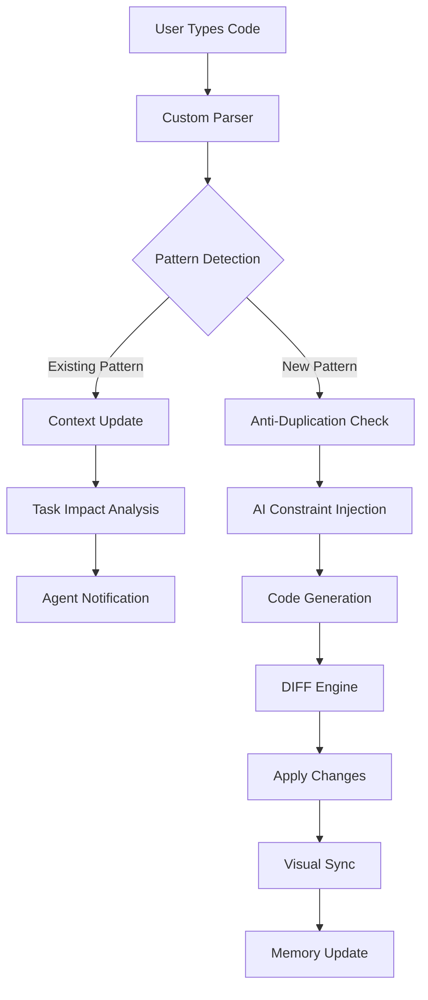

# System Integration Architecture
## AI Master Tool - Unified Component Integration

**Version:** 1.0  
**Date:** January 2025  
**Status:** Draft

---

## Overview

This document defines how all AI Master Tool components integrate into a cohesive system. Each component was designed with integration in mind, but this specification ensures they work together seamlessly.

## Integration Architecture

### 1. Master Integration Bus

```rust
pub struct SystemIntegrationBus {
    // Core components
    parser_engine: Arc<Mutex<CustomParserEngine>>,
    context_manager: Arc<Mutex<ContextOrchestrator>>,
    task_manager: Arc<Mutex<TaskManagementSystem>>,
    diff_engine: Arc<Mutex<DiffEngine>>,
    memory_system: Arc<Mutex<UnifiedMemorySystem>>,
    ai_providers: Arc<Mutex<AIProviderManager>>,
    
    // Integration channels
    event_bus: EventBus,
    data_pipeline: DataPipeline,
    
    pub async fn initialize(&mut self) -> Result<()> {
        // Set up cross-component pipelines
        self.setup_parser_to_antiduplication_pipeline().await?;
        self.setup_context_task_synchronization().await?;
        self.setup_memory_sharing_protocol().await?;
        self.setup_performance_monitoring().await?;
        
        // Initialize component connections
        self.connect_all_components().await?;
        
        Ok(())
    }
}
```

## Critical Integration Pipelines

### 1. Parser → Anti-Duplication Pipeline

```rust
pub struct ParserAntiDuplicationPipeline {
    pattern_queue: Arc<Mutex<PatternQueue>>,
    duplication_detector: Arc<DuplicationDetector>,
    
    pub async fn setup(&self, parser: &CustomParserEngine, ai_engine: &AIEngine) {
        // Real-time pattern detection feed
        parser.on_pattern_detected(move |pattern| {
            let queue = self.pattern_queue.clone();
            let detector = self.duplication_detector.clone();
            
            tokio::spawn(async move {
                // Immediate duplication check
                if let Some(existing) = detector.find_similar(&pattern).await {
                    // Inject into AI context immediately
                    ai_engine.inject_constraint(DuplicationConstraint {
                        pattern: pattern,
                        existing: existing,
                        action: ConstraintAction::PreventDuplication,
                    }).await;
                }
                
                // Queue for batch processing
                queue.lock().await.push(pattern);
            });
        });
        
        // Batch processing for efficiency
        tokio::spawn(self.process_pattern_batches());
    }
    
    async fn process_pattern_batches(&self) {
        loop {
            tokio::time::sleep(Duration::from_millis(100)).await;
            
            let patterns = self.pattern_queue.lock().await.drain_all();
            if patterns.is_empty() { continue; }
            
            // Update pattern database
            self.duplication_detector.update_patterns(patterns).await;
            
            // Train AI on new patterns
            self.train_ai_on_patterns(patterns).await;
        }
    }
}
```

### 2. Context-Task Synchronization

```typescript
class ContextTaskSynchronizer {
  private contextManager: ContextOrchestrator;
  private taskManager: TaskManagementSystem;
  private syncState: SynchronizationState;
  
  async synchronize() {
    // Bidirectional sync between context and task systems
    
    // Task → Context: When tasks are created, prepare context
    this.taskManager.on('task:created', async (task) => {
      const context = await this.contextManager.prepareTaskContext(task);
      task.attachContext(context);
      
      // Set up context slicing for parallel tasks
      if (task.parallelizable) {
        const slices = await this.contextManager.createParallelSlices(
          context,
          task.parallelBranches
        );
        task.attachContextSlices(slices);
      }
    });
    
    // Context → Task: When context changes, update tasks
    this.contextManager.on('context:significant_change', async (change) => {
      const affectedTasks = await this.taskManager.findAffectedTasks(change);
      
      for (const task of affectedTasks) {
        if (task.status === TaskStatus.InProgress) {
          // Notify agent of context change
          await this.notifyAgentOfContextChange(task.assignedAgent, change);
          
          // Potentially replan task
          if (this.requiresReplan(change, task)) {
            await this.taskManager.replanTask(task);
          }
        }
      }
    });
    
    // Conflict detection integration
    this.setupConflictDetection();
  }
  
  private setupConflictDetection() {
    // Real-time conflict detection between parallel contexts
    this.taskManager.on('task:file_modified', async (event) => {
      const conflicts = await this.contextManager.detectContextConflicts(
        event.taskId,
        event.modifiedFiles
      );
      
      if (conflicts.length > 0) {
        // Update task conflict zones
        await this.taskManager.updateConflictZones(event.taskId, conflicts);
        
        // Notify context manager to adjust slicing
        await this.contextManager.adjustParallelSlices(conflicts);
      }
    });
  }
}
```

### 3. Unified Memory System

```rust
pub struct UnifiedMemorySystem {
    // Component-specific stores with shared protocol
    parser_memory: ParserMemoryStore,
    context_memory: ContextMemoryStore,
    task_memory: TaskMemoryStore,
    user_memory: UserPreferenceStore,
    code_memory: CodePatternStore,
    
    // Shared memory pool
    shared_pool: SharedMemoryPool,
    
    pub async fn initialize(&mut self) {
        // Set up memory sharing protocol
        self.setup_memory_federation().await;
        
        // Initialize cross-component indices
        self.build_unified_indices().await;
    }
    
    pub async fn store_learning(&self, learning: Learning) -> Result<()> {
        // Route to appropriate stores
        match learning.learning_type {
            LearningType::CodePattern => {
                self.code_memory.store(&learning).await?;
                self.parser_memory.update_patterns(&learning).await?;
            },
            LearningType::UserPreference => {
                self.user_memory.store(&learning).await?;
                self.context_memory.update_preferences(&learning).await?;
            },
            LearningType::TaskPattern => {
                self.task_memory.store(&learning).await?;
                self.shared_pool.broadcast(&learning).await?;
            },
            _ => self.shared_pool.store(&learning).await?,
        }
        
        Ok(())
    }
    
    pub async fn recall_integrated(&self, query: MemoryQuery) -> IntegratedMemory {
        // Parallel search across all stores
        let futures = vec![
            self.parser_memory.search(&query),
            self.context_memory.search(&query),
            self.task_memory.search(&query),
            self.user_memory.search(&query),
            self.code_memory.search(&query),
        ];
        
        let results = futures::future::join_all(futures).await;
        
        // Integrate and rank results
        self.integrate_memories(results, query)
    }
}
```

### 4. DIFF-Visual Builder Integration

```typescript
class DiffVisualIntegration {
  private diffEngine: DiffEngine;
  private visualBuilder: VisualBuilder;
  private syncEngine: BidirectionalSyncEngine;
  
  setupBidirectionalSync() {
    // Visual → Code: Generate optimal diffs
    this.visualBuilder.on('component:changed', async (change) => {
      // Generate code for visual change
      const newCode = await this.visualBuilder.generateCode(change);
      
      // Use DIFF engine to create minimal edit
      const diff = await this.diffEngine.computeOptimalDiff(
        change.originalCode,
        newCode,
        {
          strategy: DiffStrategy.Structural, // Best for visual changes
          preserveFormatting: true,
          minimizeChurn: true,
        }
      );
      
      // Apply diff to code editor
      await this.applyDiffToEditor(diff);
    });
    
    // Code → Visual: Parse and update visual
    this.codeEditor.on('code:changed', async (change) => {
      // Use custom parser for accurate AST
      const ast = await this.parser.parseIncremental(change);
      
      // Detect visual-relevant changes
      const visualChanges = this.detectVisualChanges(ast, change);
      
      if (visualChanges.length > 0) {
        // Update visual representation
        await this.visualBuilder.updateFromAST(visualChanges);
      }
    });
  }
  
  private async handleConflicts(codeChange: Change, visualChange: Change) {
    // Intelligent conflict resolution
    const resolution = await this.diffEngine.resolveConflict(
      codeChange,
      visualChange,
      {
        preferSource: 'latest', // or 'code' or 'visual'
        preserveIntent: true,
        validateOutput: true,
      }
    );
    
    // Apply resolution to both sides
    await this.applyResolution(resolution);
  }
}
```

### 5. Performance Monitoring Integration

```rust
pub struct IntegratedPerformanceMonitor {
    metrics_collector: MetricsCollector,
    performance_analyzer: PerformanceAnalyzer,
    optimization_engine: OptimizationEngine,
    
    pub async fn setup_monitoring(&mut self, components: &SystemComponents) {
        // Parser performance
        components.parser.set_metrics_hook(|metrics| {
            self.metrics_collector.record("parser", metrics);
        });
        
        // Context management performance
        components.context_manager.set_metrics_hook(|metrics| {
            self.metrics_collector.record("context", metrics);
            
            // Real-time optimization
            if metrics.context_size > CONTEXT_THRESHOLD {
                self.optimization_engine.trigger_context_optimization();
            }
        });
        
        // Task execution performance
        components.task_manager.set_metrics_hook(|metrics| {
            self.metrics_collector.record("tasks", metrics);
            
            // Detect bottlenecks
            if let Some(bottleneck) = self.detect_bottleneck(&metrics) {
                self.handle_bottleneck(bottleneck).await;
            }
        });
        
        // Start analysis loop
        tokio::spawn(self.continuous_analysis());
    }
    
    async fn continuous_analysis(&self) {
        let mut interval = tokio::time::interval(Duration::from_secs(5));
        
        loop {
            interval.tick().await;
            
            // Analyze cross-component performance
            let analysis = self.performance_analyzer.analyze_system(
                &self.metrics_collector.get_recent_metrics()
            );
            
            // Apply optimizations
            if let Some(optimizations) = analysis.suggested_optimizations {
                self.apply_system_optimizations(optimizations).await;
            }
            
            // Update dashboards
            self.update_performance_dashboards(&analysis).await;
        }
    }
}
```

## Data Flow Integration

### 1. Code Change Flow



### 2. Task Execution Flow

```typescript
class IntegratedTaskExecution {
  async executeTask(task: Task): Promise<TaskResult> {
    // 1. Prepare integrated context
    const context = await this.prepareIntegratedContext(task);
    
    // 2. Select optimal agent with full system awareness
    const agent = await this.selectAgent(task, {
      considerMemory: true,
      considerCurrentLoad: true,
      considerSpecialization: true,
    });
    
    // 3. Execute with all systems engaged
    const execution = await this.executeWithIntegration(agent, task, context);
    
    // 4. Process results through all systems
    await this.processResults(execution);
    
    return execution.result;
  }
  
  private async prepareIntegratedContext(task: Task): Promise<IntegratedContext> {
    // Gather from all systems
    const [memory, patterns, history, preferences] = await Promise.all([
      this.memory.recallForTask(task),
      this.parser.getRelevantPatterns(task),
      this.contextLineage.getRelevantHistory(task),
      this.userMemory.getPreferences(task),
    ]);
    
    // Build integrated context
    return new IntegratedContext({
      task,
      memory,
      patterns,
      history,
      preferences,
      constraints: this.buildConstraints(task, patterns),
    });
  }
  
  private async processResults(execution: TaskExecution): Promise<void> {
    // Update all systems
    await Promise.all([
      this.memory.learn(execution),
      this.parser.updatePatterns(execution),
      this.taskManager.updateMetrics(execution),
      this.contextManager.updateContext(execution),
    ]);
  }
}
```

## Component Communication Protocols

### 1. Event Bus Protocol

```rust
pub enum SystemEvent {
    // Parser events
    PatternDetected { pattern: Pattern, confidence: f32 },
    ParseCompleted { file: String, ast: AST },
    
    // Context events
    ContextOverflow { agent: AgentId, overflow: usize },
    ContextSwitch { from: ContextId, to: ContextId },
    
    // Task events
    TaskCreated { task: Task },
    TaskConflict { task1: TaskId, task2: TaskId, conflict: Conflict },
    
    // Memory events
    MemoryLearned { learning: Learning },
    MemoryRecalled { query: Query, results: Vec<Memory> },
    
    // Performance events
    PerformanceThreshold { component: String, metric: String, value: f64 },
}

impl EventBus {
    pub async fn emit(&self, event: SystemEvent) {
        // Route to all interested components
        let handlers = self.get_handlers(&event);
        
        // Process in parallel
        let futures: Vec<_> = handlers.iter()
            .map(|handler| handler.handle(event.clone()))
            .collect();
        
        futures::future::join_all(futures).await;
    }
}
```

### 2. Data Pipeline Protocol

```typescript
interface DataPipelineProtocol {
  // Define data transformation pipeline
  pipeline<T, R>(
    source: DataSource<T>,
    transformations: Transform<T, R>[],
    sink: DataSink<R>
  ): Pipeline<T, R>;
}

class SystemDataPipeline implements DataPipelineProtocol {
  // Example: Parser → Anti-duplication → AI
  setupParserPipeline() {
    return this.pipeline(
      this.parser.patternStream(),
      [
        this.enrichWithContext(),
        this.checkDuplication(),
        this.scoreRelevance(),
        this.prepareForAI(),
      ],
      this.aiEngine.constraintSink()
    );
  }
  
  // Example: Task → Context → Agent
  setupTaskPipeline() {
    return this.pipeline(
      this.taskManager.taskStream(),
      [
        this.enrichWithMemory(),
        this.prepareContext(),
        this.optimizeForAgent(),
        this.addConstraints(),
      ],
      this.agentPool.taskSink()
    );
  }
}
```

## Integration Testing Framework

```rust
#[cfg(test)]
mod integration_tests {
    use super::*;
    
    #[tokio::test]
    async fn test_full_system_integration() {
        // Initialize all components
        let mut system = SystemIntegrationBus::new();
        system.initialize().await.unwrap();
        
        // Test parser → anti-duplication flow
        let code = "function duplicate() { return 42; }";
        let ast = system.parser_engine.parse(code).await.unwrap();
        
        // Should detect pattern and prevent duplication
        let ai_response = system.ai_providers
            .complete("create a function that returns 42")
            .await
            .unwrap();
        
        assert!(!ai_response.contains("function duplicate"));
        assert!(ai_response.contains("existing function"));
        
        // Test context → task synchronization
        let task = system.task_manager.create_task("refactor duplicate function").await.unwrap();
        let context = system.context_manager.get_task_context(&task.id).await.unwrap();
        
        assert!(context.has_pattern("duplicate_function"));
        assert!(context.has_constraint("no_duplication"));
    }
    
    #[tokio::test]
    async fn test_parallel_execution_integration() {
        let mut system = SystemIntegrationBus::new();
        system.initialize().await.unwrap();
        
        // Create parallel tasks
        let tasks = vec![
            "modify file1.ts",
            "modify file2.ts",
            "modify file3.ts",
        ];
        
        let task_ids = system.task_manager
            .create_parallel_tasks(tasks)
            .await
            .unwrap();
        
        // Execute in parallel
        let results = system.execute_parallel(task_ids).await.unwrap();
        
        // Verify no conflicts
        assert!(results.conflicts.is_empty());
        
        // Verify context isolation
        for (i, result) in results.iter().enumerate() {
            assert_eq!(result.modified_files.len(), 1);
            assert!(result.modified_files[0].contains(&format!("file{}.ts", i + 1)));
        }
    }
}
```

## Performance Optimization Guidelines

### 1. Cross-Component Caching

```rust
pub struct IntegratedCache {
    // Shared cache for all components
    l1_cache: Arc<DashMap<CacheKey, CacheEntry>>, // In-memory
    l2_cache: Arc<RocksDB>, // On-disk
    
    pub async fn get_or_compute<T, F>(&self, key: CacheKey, compute: F) -> Result<T>
    where
        F: Future<Output = Result<T>>,
        T: Serialize + DeserializeOwned,
    {
        // Check L1
        if let Some(entry) = self.l1_cache.get(&key) {
            return Ok(entry.value());
        }
        
        // Check L2
        if let Some(data) = self.l2_cache.get(&key).await? {
            let value: T = deserialize(&data)?;
            self.l1_cache.insert(key.clone(), value.clone());
            return Ok(value);
        }
        
        // Compute and cache
        let value = compute.await?;
        self.cache_value(key, &value).await?;
        Ok(value)
    }
}
```

### 2. Resource Pooling

```typescript
class IntegratedResourcePool {
  private parserPool: ObjectPool<Parser>;
  private contextPool: ObjectPool<Context>;
  private agentPool: ObjectPool<Agent>;
  
  async allocateResources(task: Task): Promise<TaskResources> {
    // Allocate resources based on task requirements
    const resources = await Promise.all([
      this.parserPool.acquire(task.parserRequirements),
      this.contextPool.acquire(task.contextRequirements),
      this.agentPool.acquire(task.agentRequirements),
    ]);
    
    return new TaskResources({
      parser: resources[0],
      context: resources[1], 
      agent: resources[2],
      release: async () => {
        await Promise.all([
          this.parserPool.release(resources[0]),
          this.contextPool.release(resources[1]),
          this.agentPool.release(resources[2]),
        ]);
      },
    });
  }
}
```

## Deployment Configuration

```yaml
# docker-compose.yml for integrated system
version: '3.8'

services:
  ai-master-tool:
    build: .
    environment:
      - PARSER_WORKERS=4
      - CONTEXT_CACHE_SIZE=1GB
      - TASK_PARALLEL_LIMIT=10
      - MEMORY_POOL_SIZE=2GB
    volumes:
      - ./data:/app/data
      - ./cache:/app/cache
    ports:
      - "3000:3000"
    
  vector-db:
    image: qdrant/qdrant
    volumes:
      - ./qdrant:/qdrant/storage
    
  cache:
    image: redis:alpine
    volumes:
      - ./redis:/data
```

## Summary

This integration architecture ensures:

1. **Seamless Data Flow**: Components communicate efficiently through defined pipelines
2. **No Duplicate Effort**: Shared memory and caching prevent redundant computations
3. **Consistent State**: Synchronization protocols maintain consistency across components
4. **Optimal Performance**: Resource pooling and intelligent caching maximize efficiency
5. **Extensibility**: New components can easily integrate through standard protocols

The system operates as a unified whole rather than separate components, providing a superior development experience.