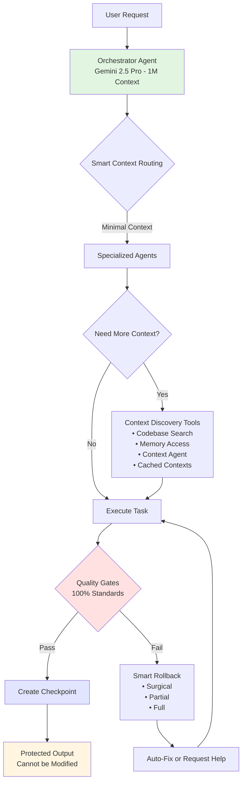

# 100% Error-Free Development System Overview
## AI Master Tool - How Perfect Code is Guaranteed

**Version:** 1.0  
**Date:** January 2025  

---

## System Architecture for Zero Errors



## The Five Pillars of Perfect Code

### 1. Strict Agent Boundaries
```typescript
// No agent can mess up another's work
const rules = {
  coder: "Creates code, cannot modify designs",
  reviewer: "Reviews code, cannot modify it",
  tester: "Creates tests, cannot modify code",
  // Only designated editors can modify with permission
};
```

### 2. Intelligent Context Management
```typescript
// Start minimal, discover as needed
const contextFlow = {
  initial: "Only what's explicitly requested",
  discovery: "Powerful tools to find what's needed",
  caching: "All contexts saved for reference",
  routing: "Smart distribution prevents overflow"
};
```

### 3. Continuous Quality Monitoring
```typescript
// Every change is validated in real-time
const qualityGates = {
  syntax: 100,      // Must be perfect
  types: 100,       // Must be type-safe
  tests: 100,       // All must pass
  coverage: 85,     // Minimum coverage
  security: 100,    // Zero vulnerabilities
  bestPractices: 98 // Near-perfect compliance
};
```

### 4. Micro-Checkpoint System
```typescript
// Instant recovery from any error
const checkpoints = {
  micro: "Every significant change (ms)",
  phase: "Every completed phase (minutes)",
  milestone: "Major features (hours)",
  
  rollback: {
    surgical: "Fix only the problem",
    partial: "Preserve good work",
    full: "Complete restoration"
  }
};
```

### 5. Context Discovery Tools
```typescript
// No agent is ever starved for information
const discoveryTools = {
  codebaseSearch: "Find any relevant code",
  memoryAccess: "Learn from patterns",
  contextAgent: "AI helper for finding context",
  cachedContexts: "Access what others know",
  validation: "Verify assumptions"
};
```

## How It Works: Step by Step

### Step 1: Request Processing
```yaml
user_request: "Add authentication to the app"
orchestrator:
  model: "gemini-2.5-pro"
  context: 1M tokens
  action: "Break down into tasks"
```

### Step 2: Task Distribution with Minimal Context
```yaml
architect:
  receives: "Design auth system"
  context: "Requirements only (10K tokens)"
  
coder:
  receives: "Implement auth"
  context: "Design + interfaces (50K tokens)"
  
tester:
  receives: "Test auth"
  context: "Interfaces only (20K tokens)"
```

### Step 3: Context Discovery When Needed
```typescript
// Coder realizes it needs more info
coder.discover({
  search: "existing auth patterns in project",
  memory: "previous security decisions",
  contextAgent: "find JWT implementation examples"
});
// Gets exactly what's needed, no more
```

### Step 4: Quality Gates Enforcement
```yaml
code_output:
  syntax: ✓ 100%
  types: ✓ 100%
  tests: ✓ 100%
  coverage: ✓ 87%
  security: ✓ 100%
  result: PASS → Create checkpoint
```

### Step 5: Output Protection
```yaml
claude_sonnet_4_output:
  code: "Perfect authentication implementation"
  protection: ENFORCED
  can_modify: ["claude-sonnet-4"]  # Only itself
  can_read: ["*"]                   # Anyone
  can_annotate: ["*"]               # Anyone
```

## Common Scenarios

### Scenario 1: Type Error
```
1. Micro-checkpoint detects error instantly
2. Surgical rollback to exact line
3. Auto-fix applied
4. Continue without losing any work
```

### Scenario 2: Context Overflow
```
1. Agent requests too much context
2. Smart router filters to essentials
3. Agent uses discovery tools for specifics
4. No overflow, no lost information
```

### Scenario 3: Quality Drop
```
1. Real-time monitor detects issue
2. Quality gate blocks progression
3. Suggestions provided
4. Must fix before continuing
```

## Configuration for 100% Success

```yaml
symbiote_config:
  # Agent boundaries
  enforce_boundaries: strict
  output_protection: enforced
  
  # Context management
  default_context: minimal
  discovery_tools: enabled
  context_caching: comprehensive
  
  # Quality enforcement
  quality_gates:
    blocking: true
    auto_fix: true
    standards: maximum
    
  # Checkpoint system
  checkpoints:
    micro: every_change
    rollback: intelligent
    preservation: maximum
    
  # Success metrics
  target_quality: 100%
  acceptable_errors: 0
  recovery_time: instant
```

## Why This Works

### 1. **Prevention Over Correction**
- Agents can't break each other's work
- Context overflow is impossible
- Quality gates catch issues instantly

### 2. **Smart Recovery**
- Micro-checkpoints enable instant rollback
- Surgical fixes preserve good work
- Learning system prevents repeat issues

### 3. **No Information Starvation**
- Minimal context prevents overflow
- Discovery tools provide what's needed
- Cached contexts share knowledge

### 4. **Enforced Excellence**
- 100% syntax and type correctness
- Mandatory test coverage
- Best practices built-in

### 5. **Protected Quality**
- Superior outputs can't be degraded
- Each agent stays in their lane
- Orchestrator coordinates, doesn't modify

## The Result

```typescript
const result = {
  codeQuality: "100%",
  errors: 0,
  recoveryTime: "instant",
  developerExperience: "frustration-free",
  productivity: "maximum",
  
  // The dream of perfect AI-assisted development
  reality: true
};
```

---

This system ensures that AI Master Tool delivers on its promise: **100% error-free coding at absolute best practice and top standards**, achieved through intelligent orchestration, strict boundaries, and instant recovery mechanisms.